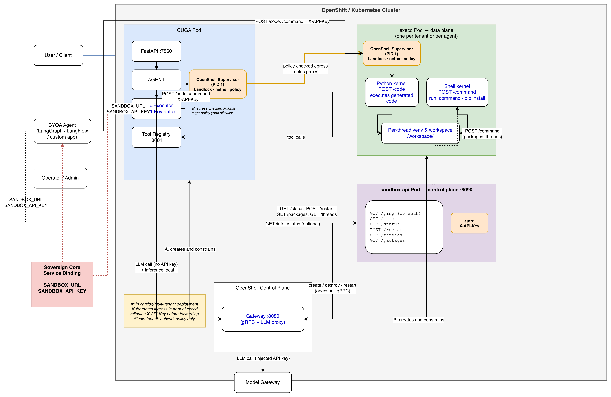
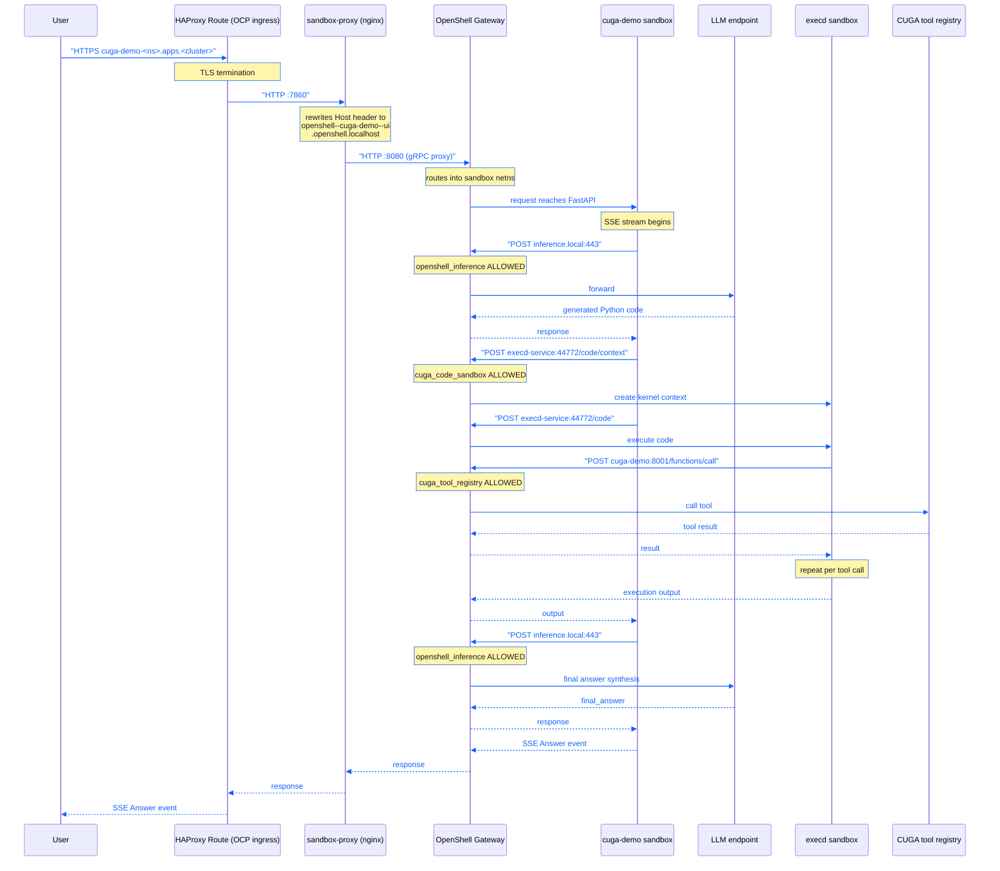
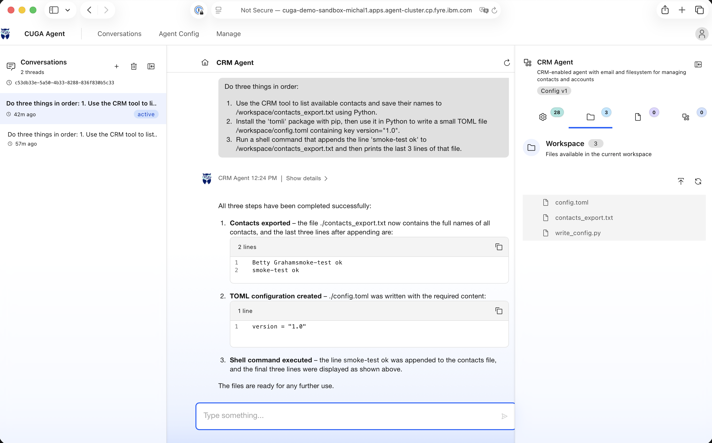

# Sandboxing

Everything related to running CUGA under a sandbox runtime lives in `./sandbox` folder.

| Directory | Contents |
|---|---|
| [`cuga/`](cuga/) | CUGA image, confinement policy, entrypoint |
| [`sandbox/`](sandbox/) | OpenShell control plane, execd code-execution sandbox, management API, Host-rewrite proxy |

> New to OpenShell or OpenSandbox? Read [`EXPLAIN.md`](EXPLAIN.md) first — it covers
> how the supervisor model works, how pods are created, how traffic is routed into a
> sandbox netns, and what execd is and is not.

> **`./sandbox`** is a candidate for its own repo once a non-CUGA team needs to
> deploy it independently.

---

## Security model

CUGA generates and executes Python code on behalf of users. This requires two independent containment boundaries - neither alone is sufficient.

| | Role A - CUGA pod | Role B - execd pod |
|---|---|---|
| **What it wraps** | The entire CUGA agent process | Generated code (separate pod, separate process) |
| **LLM API key** | Never enters the pod - gateway injects on egress | No access to inference endpoint at all |
| **Filesystem** | Writes confined to `/sandbox` and `/tmp` | Writes confined to `/workspace/<thread>`; agent databases unreachable |
| **Egress** | Per-binary allowlist - inference + execd only | Per-binary allowlist - tool registry + PyPI only |
| **Privilege** | Unprivileged user, no escalation | Unprivileged user, no escalation |
| **Isolation from agent** | n/a | Separate pod, separate process, no shared env or memory |

- **Role A without Role B** - generated code runs inside the agent process with the same privileges: it can reach the inference gateway, read agent state and environment variables, and write to agent databases.
- **Role B without Role A** - the agent process itself is unrestricted: it could exfiltrate the LLM key, write outside its sandbox, or make arbitrary outbound calls.

Both roles are implemented. Role A is enforced by `cuga-policy.yaml`; Role B by `execd-policy.yaml`. See [§Two-boundary security model](#two-boundary-security-model) in the Architecture section for the internal kernel structure.

### OpenSandbox execd - the code execution engine

The execd pod is built on [`opensandbox/execd`](https://github.com/cohere-ai/opensandbox) - an Apache 2.0 open-source execution daemon from the OpenSandbox project. We use **only the execd component**, not the full OpenSandbox server:

| Component | Used | Why |
|---|---|---|
| `execd` binary | ✅ | HTTP server for `POST /code`, `POST /code/context`, `POST /command` |
| `bwrap` (bubblewrap) | ✅ | Per-execution namespace isolation inside the pod |
| `opensandbox-session-gate` | ✅ | Session entry point for isolated executions |
| `opensandbox-launcher` | ✅ | Required by the hardening floor; absent from versioned tags before 2026-08-25 |
| OpenSandbox server | ❌ | Creates containers via Docker/Kubernetes - not needed; OpenShell manages pod lifecycle |

execd exposes a Jupyter kernel protocol over HTTP. Each `POST /code/context` creates a new kernel (a persistent Python process); subsequent `POST /code` calls on that context share interpreter state. CUGA already has a client (`ExecdExecutor`) that speaks this protocol - the same serialisation pattern used by `E2BExecutor` is reused directly.

### What OpenShell provides in each role

**Role A - CUGA pod:**
- **Policy engine** - declarative YAML allowlist (`cuga-policy.yaml`) applied by the supervisor (PID 1); every outbound connection from the agent process is checked against it before leaving the network namespace. Egress not on the list is denied without any code change.
- **LLM key injection** - the gateway intercepts calls to `inference.local:443` and injects the real API key on the wire; the key is never written to the pod env, filesystem, or passed to the agent process.
- **Filesystem confinement** - Landlock restricts which paths the agent process can read or write; `/app` is read-only, only `/sandbox` and `/tmp` are writable.
- **Sandbox lifecycle** - the gateway creates and destroys the pod; the supervisor enforces that the workload cannot escape its network namespace.

**Role B - execd pod:**
- **Network namespace isolation** - generated code runs in a private netns with no default route; the only reachable hosts are those explicitly listed in `execd-policy.yaml` (tool registry, PyPI, nothing else).
- **Per-binary egress enforcement** - each allowed connection is tied to a specific binary path (e.g. only `/opt/app-root/bin/uv` can reach PyPI, only `python*` can reach the tool registry). A process not on the binary list is denied even if the host is allowed.
- **Filesystem confinement** - only `/workspace` is writable; the agent's `/sandbox`, databases, and env are on a separate pod and filesystem - unreachable by construction, not just by policy.
- **OCSF audit trail** - every ALLOWED/DENIED decision is emitted as a structured event with binary path, PID, destination, and policy name; this is what the smoke-test timeline shows.

---

## Deployment targets

Two deployment types are supported. Both use the same policy files and the same
smoke test - only the infrastructure layer differs.

| | Rancher Desktop | OpenShift |
|---|---|---|
| Platform | macOS, local Docker | Remote amd64 cluster |
| Gateway driver | `docker` socket | `kubernetes` (kube API + RBAC) |
| Policy files | `sandbox/deploy/rancher/` + `cuga/deploy/rancher/` | `sandbox/deploy/openshift/` + `cuga/deploy/openshift/` |
| Inbound to sandbox | `openshell forward` (host-side tunnel) | `openshell service expose` + gateway |
| Host-header rewrite | not needed | `sandbox-proxy` (nginx) |
| UI access | `http://localhost:7860` | Route → proxy → gateway → sandbox |
| TLS | Off | On |
| Auth | Unauthenticated (local dev) | OIDC + `X-API-Key` |

---

## Configuration

### Policy files

Each sandbox has its own policy file that defines an explicit egress allowlist.
The supervisor **denies everything not listed** - no host is reachable by default.

| Platform | execd policy (generated code) | CUGA policy (agent + inference) |
|---|---|---|
| Rancher | [`sandbox/deploy/rancher/execd-policy.yaml`](sandbox/sandbox/deploy/rancher/execd-policy.yaml) | [`cuga/deploy/rancher/cuga-policy.yaml`](sandbox/cuga/deploy/rancher/cuga-policy.yaml) |
| OpenShift | [`sandbox/deploy/openshift/execd-policy.yaml`](sandbox/sandbox/deploy/openshift/execd-policy.yaml) | [`cuga/deploy/openshift/cuga-policy.yaml`](sandbox/cuga/deploy/openshift/cuga-policy.yaml) |

To allow a new host, add a `network_policies` block to the relevant policy file
and redeploy. The policy is the source of truth - changes take effect after the
sandbox is recreated.

### Package index for agent-written code

Installs are wired up out of the box: `cuga-entrypoint.sh` points CUGA at
`https://pypi.org/simple` and both `execd-policy.yaml` variants carry a
`python_package_index` policy allowing `pypi.org` and `files.pythonhosted.org`.
The smoke test exercises this end to end (`uv pip install tomli`).

To use an **internal mirror** instead of PyPI, change two things together -
miss either one and installs fail closed:

**1. Edit `execd-policy.yaml`** - replace the `python_package_index` endpoints
with your registry host. The `binaries` list must include `uv` (the actual
fetcher) and `python*`:

```yaml
# sandbox/sandbox/deploy/{rancher,openshift}/execd-policy.yaml
network_policies:
  python_package_index:
    name: python-package-index
    endpoints:
      - host: pypi.internal.example.com
        port: 443
        protocol: rest
        enforcement: enforce
        access: read-write
    binaries:
      - { path: /usr/local/bin/uv }               # Rancher
      - { path: /opt/app-root/bin/uv }             # OpenShift (UBI9)
      - { path: /usr/local/bin/python* }
      - { path: /workspace/*/.venv/bin/python* }
```

**2. Edit `cuga-entrypoint.sh`** - set the index URL:

```bash
export DYNACONF_ADVANCED_FEATURES__EXECD_PACKAGE_INDEX="${CUGA_EXECD_PACKAGE_INDEX:-https://pypi.internal.example.com/simple}"
```

When `execd_package_index` is set, CUGA injects `UV_INDEX_URL`,
`PIP_INDEX_URL`, and `UV_INDEX_STRATEGY=first-index` into every new thread's
bootstrap so every install is locked to that index.

---

### Parameters - what to set and where

**1. Deploy-time variables** - on the `make` command line or exported:

| Variable | Platform | Default | Purpose |
|---|---|---|---|
| `OPENAI_API_KEY` | both | *(required)* | LLM credential. Never reaches the agent - see §Keys and secrets |
| `OPENAI_BASE_URL` | both | *(required)* | LLM endpoint the gateway calls |
| `MODEL_NAME` | both | *(required)* | Model id passed to the inference route |
| `REGISTRY` | OpenShift | *(required)* | Where the CUGA image is pushed, e.g. `icr.io/<ns>` |
| `ICR_API_KEY` | OpenShift | *(required)* | Creates the in-cluster pull secret for builds |
| `NAMESPACE` | OpenShift | `sandbox-$(whoami)` | Target namespace |
| `OPENSHELL_WORKSPACE` | both | `openshell` | Prefix in `<workspace>--<sandbox>` pod names |
| `IMAGE_TAG` | OpenShift | `latest` | Tag for the CUGA image |

**2. Behaviour knobs inside the CUGA image** (`cuga/cuga-entrypoint.sh`)

| Variable | Default | Effect |
|---|---|---|
| `CUGA_SANDBOX_MODE` | `execd` | Where generated code runs |
| `CUGA_ENABLE_SHELL_TOOL` | `true` | Enables `run_command` and package installs |
| `CUGA_EXECD_PACKAGE_INDEX` | `https://pypi.org/simple` | Index for installs - must match egress policy |
| `CUGA_AUTO_APPROVE` | `false` | Auto-approve tool calls |
| `CUGA_EXECD_URL` | `http://host.openshell.internal:44772` | Rancher default; OpenShift overrides via `--env` |
| `CUGA_FUNCTION_CALL_HOST` | `http://host.openshell.internal:8001` | Same |

**Smoke test** reads `SANDBOX_NAMESPACE`, `OPENSHELL_WORKSPACE`, `CUGA_URL`,
`SMOKE_WAIT` (default 120 s) and `OPENSHELL_PF_PORT`.

---

### Keys and secrets

Short version: you supply two, the deployment generates the rest, and the agent
sandbox receives none of them.

| Secret | Who creates it | Where it lives | Who reads it |
|---|---|---|---|
| `OPENAI_API_KEY` | you | Secret `llm-credentials` → gateway pod env | **gateway only** |
| `ICR_API_KEY` | you (IBM Cloud) | `docker login` + Secret `icr-pull-secret` | image pulls / in-cluster builds |
| `SANDBOX_API_KEY` | generated (`openssl rand -hex 32`) | Secret `sandbox-credentials` | `sandbox-api` control plane |
| Gateway JWT keypair | generated by the `generate-certs` init container | PVC `openshell-state` | gateway |
| `JUPYTER_TOKEN` | generated per start inside execd | process env only | execd → its own loopback Jupyter |

**The agent never holds the LLM credential.** The sandbox calls `inference.local`,
the supervisor intercepts it, and the gateway substitutes the real key on the
way out. A compromised agent cannot exfiltrate a key it was never given.

**execd's own data plane is unauthenticated by default.**
`advanced_features.execd_api_key` is empty, so CUGA logs a warning on every call
and execd accepts any caller that can reach `:44772`. That is acceptable while
the only route to it is a cluster-internal Service plus the sandbox egress
policy. It is *not* acceptable for a multi-tenant or BYOA deployment - there,
set `execd_api_key` to `SANDBOX_API_KEY` (env:
`DYNACONF_ADVANCED_FEATURES__EXECD_API_KEY`) and put an Ingress in front of
execd that validates `X-API-Key`.

---

## Quick start (Rancher Desktop, macOS)

```bash
cd sandbox
make rancher-up \
  OPENAI_API_KEY="sk-..." \
  OPENAI_BASE_URL="https://your-llm-endpoint" \
  MODEL_NAME="your-model-id"

make smoke-test          # end-to-end verification
make rancher-down        # tear everything down
```

UI: `http://localhost:7860`

The sandbox has no inbound address of its own - `rancher-up` starts three
background tunnels through the gateway:

| Port | Sandbox | What it carries |
|---|---|---|
| 7860 | cuga-demo | Gradio UI |
| 8001 | cuga-demo | tool registry (execd → CUGA) |
| 44772 | code-exec | execd API (CUGA → execd) |

Run `make help` for the full target reference.

---

## Deploying on OpenShift (remote amd64 cluster)

### Cluster prerequisites (one-time, cluster-admin required)

OpenShell's Kubernetes compute driver requires the
[Agent Sandbox CRD](https://github.com/kubernetes-sigs/agent-sandbox).
Install it once per cluster before the first `make ocp-deploy`:

```bash
# Check if already installed
oc get crd sandboxes.agents.x-k8s.io

# If not - install (no admission webhooks, safe to apply on a live cluster)
oc apply -f https://github.com/kubernetes-sigs/agent-sandbox/releases/download/v1.0.0/sandbox.yaml

# Verify
oc rollout status deploy/agent-sandbox-controller -n agent-sandbox-system
```

Verified on `agent-cluster` (2026-08-30): release `v1.0.0`, API version
`v1beta1`, controller SCC `restricted-v2`.

This install is cluster-scoped and outlives your namespace - `make ocp-wipe`
never removes the CRD or its controller. On a shared cluster check first.

---

### Workstation prerequisites

```bash
oc version        # must be ≥ 4.12
openshell --version
docker info
```

### Log in

```bash
oc login https://api.your-cluster.example.com:6443
oc whoami --show-server   # confirm target cluster

# ICR image registry (one-time)
echo "<key>" | docker login -u iamapikey --password-stdin icr.io
```

### Deploy

```bash
cd sandbox
make ocp-deploy \
  NAMESPACE="sandbox-<yourname>" \
  OPENAI_API_KEY="sk-..." \
  OPENAI_BASE_URL="https://your-llm-endpoint" \
  MODEL_NAME="your-model-id" \
  REGISTRY="icr.io/automation-saas-platform-dev" \
  ICR_API_KEY="<your-icr-api-key>"
```

`NAMESPACE` defaults to `sandbox-$(whoami)`. `make ocp-deploy` runs two steps in
sequence - sandbox stack (gateway, execd, sandbox-api) then CUGA. Each step is
also callable alone for faster iteration:

```bash
make _ocp-deploy-sandbox NAMESPACE="sandbox-<yourname>" ...
make _ocp-deploy-cuga    NAMESPACE="sandbox-<yourname>" ...
```

When done:
```
==> CUGA ready
    UI: https://cuga-demo-sandbox-<yourname>.apps.<cluster>
```

### Reaching the CUGA web UI

```bash
echo "https://$(oc get route cuga-demo -n $NAMESPACE -o jsonpath='{.spec.host}')"
```

The Route is TLS-edge. On a cluster with a self-signed certificate the browser
warns once; `curl` needs `-k`. The path is:

```
Route → Service cuga-demo → sandbox-proxy → openshell-gateway → sandbox :7860
```

`sandbox-proxy` exists only to rewrite the `Host` header, because the gateway
routes sandbox services by hostname and accepts only
`<workspace>--<sandbox>--<service>.openshell.localhost`.

Troubleshooting a `503`:

```bash
oc get pods -n $NAMESPACE
oc get endpoints cuga-demo -n $NAMESPACE
oc logs deploy/sandbox-proxy -n $NAMESPACE
openshell service list
```

### Tear down

```bash
make ocp-teardown NAMESPACE=<namespace>   # deletes sandboxes + deployments; keeps PVC + namespace
make ocp-wipe     NAMESPACE=<namespace>   # deletes the namespace and everything in it
```

---

## Architecture

### Topology (Rancher Desktop)

```
macOS host
│
├─ Rancher Desktop VM  (Linux kernel, dockerd)
│   ├─ [container] openshell-execd-gateway   :8080 gRPC, :8081 health
│   ├─ [container] sandbox-relay             :44772 + :8001  VM ↔ macOS bridge
│   └─ [container] sandbox-api               :8090  management REST API
│
│   [OpenShell sandbox]  openshell--code-exec
│       └─ execd + Jupyter                   private netns, reachable via openshell forward
│
│   [OpenShell sandbox]  openshell--cuga-demo
│       └─ cuga start demo_crm               private netns, :7860 forwarded to macOS
│
└─ openshell forward binds on macOS:
       :44772  → execd
       :7860   → CUGA Gradio UI
       :8001   → CUGA tool-call registry  (code in execd → CUGA)
```

### Topology (OpenShift)

```
namespace  sandbox-<user>
│
│  ── inbound (user traffic) ──────────────────────────────────────────────
│
│   HAProxy Route  cuga-demo-<ns>.apps.<cluster>   OCP ingress, TLS termination
│       └─→ Service cuga-demo :7860
│              └─→ [deploy] sandbox-proxy (nginx)  Host-header rewrite
│                      └─→ [deploy] openshell-gateway :8080  gRPC + policy engine
│                                 └─→ [pod] openshell--cuga-demo  (nested netns)
│                                         └─ cuga start demo_crm  :7860 :8001
│
│  ── internal (agent → execd) ────────────────────────────────────────────
│
│   Service execd-service :44772
│       └─→ sandbox-proxy ─→ gateway ─→ [pod] openshell--code-exec (nested netns)
│                                               └─ execd + Jupyter  :44772
│
│  ── control plane ───────────────────────────────────────────────────────
│
├─ [deploy] openshell-gateway    :8080 gRPC, :8081 health
├─ [deploy] sandbox-proxy        :7860 :8001 :44772  Host-header rewrite (nginx)
└─ [deploy] sandbox-api          :8090  management REST API
```

Pods are named `<workspace>--<sandbox>`. The workspace prefix comes from
`OPENSHELL_WORKSPACE` (default `openshell`).

### Architecture



### Request flow

Each user prompt crosses two sandbox boundaries:



On Rancher Desktop the addresses are `host.openshell.internal:44772` / `:8001`
(intercepted inside the sandbox netns and routed through the relay).
On OpenShift they are Service DNS names (`*.svc.cluster.local`) - the policy
files are otherwise identical.

> **Note (Rancher vs OpenShift):** On Rancher Desktop `openshell forward` creates
> a direct host-side tunnel and handles the Host-header mapping internally - no
> nginx proxy is needed. The `sandbox-relay` container bridges the Rancher Desktop
> VM network to macOS so the sandboxes can reach `host.openshell.internal` which
> resolves to the macOS-side tunnel ports.

### Two-boundary security model

OpenShell serves two distinct roles in this architecture. Neither is sufficient alone.

| | Role A - CUGA pod boundary | Role B - execd pod boundary |
|---|---|---|
| **What it wraps** | The entire CUGA agent process | The code execution pod (generated code) |
| **Status** | ✅ Implemented | ✅ Implemented (execd sandbox) |
| **LLM API key** | Never enters the pod - gateway injects on egress | No access to inference endpoint at all |
| **Filesystem** | Writes confined to `/sandbox` and `/tmp` | Writes confined to `/workspace/<thread>`; agent databases unreachable |
| **Egress** | Per-binary allowlist - inference + execd only | Per-binary allowlist - tool registry + PyPI only |
| **Privilege** | Runs as unprivileged user, no escalation | Runs as unprivileged user, no escalation |
| **Isolation from agent** | n/a | Separate pod, separate process, no shared env or memory |

**Why both are needed:**

- **Role A without Role B** - generated code runs inside the agent process with the same privileges: it can reach the inference gateway, read agent state and environment variables, and write to agent databases.
- **Role B without Role A** - the agent process itself is unrestricted on the host: it could exfiltrate the LLM key, write outside its sandbox, or make arbitrary outbound calls.

**Python kernel vs Shell kernel inside execd:**

execd runs two kernel types that share the same per-thread venv and workspace:

- **Python kernel** (`POST /code`) - persistent Python process; executes generated code and preserves variable state between steps within a thread.
- **Shell kernel** (`POST /command`) - executes shell commands; `run_command("uv pip install <pkg>")` goes through this path, not through the Tool Registry. Packages installed here are immediately available to the Python kernel in the next code block because both kernels share the same venv.

This means `uv pip install` is a shell-level operation bypassing Python's import machinery - the package lands in the venv on disk; the Python kernel picks it up on next import. It also means the `sys.modules` pollution risk (see D14) applies: once a package version is imported by the Python kernel it is cached for the lifetime of that kernel process.

### Components

| Component | Where | Role |
|---|---|---|
| **HAProxy Route** | OCP ingress (cluster-wide) | TLS termination; routes external HTTPS to the `cuga-demo` Service inside the namespace. Cannot rewrite the `Host` header - that is sandbox-proxy's job. |
| **sandbox-proxy** (nginx) | `sandbox-proxy` Deployment **(OpenShift only)** | Rewrites the `Host` header from the public OCP hostname to the OpenShell internal format (`openshell--cuga-demo--ui.openshell.localhost`). The gateway uses this header to identify which sandbox receives the request. Without it the gateway cannot route - every sandbox shares one gateway pod. Not needed on Rancher Desktop where `openshell forward` handles routing natively. |
| **OpenShell Gateway** | `openshell-gateway` Deployment | The policy enforcement point and sandbox control plane. Holds the only inbound path into a sandbox's network namespace. Checks every outbound connection from a sandbox against its `*-policy.yaml` allowlist and emits ALLOWED/DENIED OCSF events. Also proxies LLM calls, injecting the real API key so the key never enters the sandbox. |
| **cuga-demo sandbox** | `openshell--cuga-demo` Pod | The CUGA agent runtime. Runs `cuga start demo_crm` in a private network namespace managed by the OpenShell supervisor (PID 1). Exposes `:7860` (Gradio UI / REST) and `:8001` (tool registry) - both reachable only through the gateway. |
| **execd sandbox** | `openshell--code-exec` Pod | The code execution data plane. Runs a Jupyter kernel server (`execd`) in its own network namespace. Receives `POST /code` and `POST /command` requests from CUGA, executes generated Python or shell code, and calls back to the CUGA tool registry for tool results. Each thread gets an isolated `/workspace/<thread>` directory and `.venv`. |
| **CUGA tool registry** | inside cuga-demo, `:8001` | FastAPI endpoint that exposes registered tools (CRM, filesystem, etc.) as `POST /functions/call`. Called by code running inside execd when the generated Python needs a tool result. Reachable from execd only because `cuga_tool_registry` is in the execd policy allowlist. |
| **sandbox-api** | `sandbox-api` Deployment | Admin-only management sidecar. Provides `/ping`, `/status`, `/restart`, `/threads`, `/packages` over HTTP `:8090`. Talks to the gateway via gRPC to create/destroy/restart sandboxes. Not in the user request path. |
| **sandbox-relay** | Docker container (Rancher only) | Bridges the Rancher Desktop VM network to macOS. The sandboxes reach `host.openshell.internal:{44772,8001}` which this relay forwards to the macOS-side `openshell forward` tunnel. Not present on OpenShift - Service DNS takes its place. |
| **Model Gateway** | external / cluster-wide | The real LLM endpoint. The CUGA sandbox never holds the API key - it calls `inference.local:443` (a virtual hostname resolved by the OpenShell gateway) and the gateway injects the key and forwards to the real endpoint. |

### Smoke test

```bash
# OpenShift
./smoke-test.sh --platform=openshift --namespace=$NAMESPACE
make smoke-test   # uses SANDBOX_NAMESPACE env var

# Rancher Desktop
./smoke-test.sh --platform=rancher
make smoke-test   # auto-detects if docker is running
```

Platform is auto-detected from available tools (`docker` → rancher, `oc` → openshift),
or pass `--platform=` explicitly. Override the default prompt for a one-off test:

```bash
./smoke-test.sh --platform=openshift --namespace=$NAMESPACE "your prompt here"
```

`smoke-test.sh` sends one prompt and asserts on what actually landed in the
sandbox - not on what the model said it did. Three steps, each exercising a
different capability:

| Step | Exercises | Assertion |
|---|---|---|
| 1. CRM contacts → `contacts_export.txt` | tool registry + code execution + workspace write | file exists |
| 2. `uv pip install tomli` → `config.toml` | package install through egress policy | file contains `version` |
| 3. Shell command appends `smoke-test ok` | `run_command` shell tool | file contains `smoke-test ok` |

### Observed smoke-test trace

Verified run on OpenShift - all four layers in chronological order.
The `[policy/*]` lines come from the OpenShell supervisors and are the point of
the exercise: every hop is an explicit, attributed decision.

```
==> Preflight  [openshift]
  ok  cuga    (Pod) : openshell--cuga-demo  [ns=sandbox-michal1]
  ok  execd   (Pod) : openshell--code-exec  [ns=sandbox-michal1]
  ok  gateway (Pod) : openshell-gateway-6cfb67845b-nqblr  [ns=sandbox-michal1]
  ok  CUGA reachable at https://cuga-demo-sandbox-michal1.apps.agent-cluster.cp.fyre.ibm.com

==> Sending prompt  [you → cuga via HTTP]
  ..  Thread ID : smoke-1788170886
  ..  Prompt    : Do three things in order:
                  1. Use the CRM tool to list available contacts and save their
                     names to /workspace/contacts_export.txt using Python.
                  2. Install the 'tomli' package with pip, then use it in Python
                     to write a small TOML file /workspace/config.toml containing
                     key version="1.0".
                  3. Run a shell command that appends the line 'smoke-test ok' to
                     /workspace/contacts_export.txt and then prints the last 3
                     lines of that file.
  ..  Waiting up to 120s (auto-approving tool calls)...
  Stream: HTTP 200
  Event: name='CodeAgent'            data_len=426
  Event: name='CodeAgent'            data_len=1449
  Event: name='CodeAgent'            data_len=200933    ← large: CRM contacts + pip output
  Event: name='CodeAgent_Reasoning'  data_len=744
  Event: name='CodeAgent'            data_len=744
  Event: name='FinalAnswerAgent'     data_len=799
  Event: name='Answer'               data_len=23177
  Agent finished (Answer event received)
  Total approvals sent: 0                               ← fully auto-approved; no HITL needed

==> Run timeline  [thread=smoke-1788170886]

  --- Policy decisions  [cuga-demo sandbox] ---         ← heartbeat/keepalive to execd while LLM thinks
  10:08:13.667  [policy/cuga]  ALLOWED /usr/bin/python3.12(87) -> POST .../command [policy:cuga_code_sandbox engine:l7]
  ...

  10:09:00.437  [policy/cuga]  ALLOWED /usr/bin/python3.12(87) -> POST .../code/context [policy:cuga_code_sandbox engine:l7]
  10:09:00.496  [policy/cuga]  ALLOWED /usr/bin/python3.12(87) -> POST .../code/context [policy:cuga_code_sandbox engine:opa]
  10:09:00.542  [policy/cuga]  ALLOWED /usr/bin/python3.12(87) -> POST .../code         [policy:cuga_code_sandbox engine:l7]

  --- Policy decisions  [execd sandbox] ---             ← bootstrap: venv created, pip updated
  10:09:01.095  [policy/execd]  ALLOWED /opt/app-root/bin/uv(2044) -> pypi.org:443 [policy:python_package_index engine:opa]
  10:09:01.167  [policy/execd]  ALLOWED GET http://pypi.org:443/simple/pip/         [policy:python_package_index engine:l7]

  --- Code execution    [execd] ---
  10:09:01.448  [execd:code ✓]  duration=949ms  output_len=0

  --- Policy decisions  [execd sandbox] ---             ← step 1: code calls back to CRM tool registry
  10:09:01.653  [policy/execd]  ALLOWED /usr/bin/python3.12(2029) -> POST http://cuga-demo...:8001/functions/call [policy:cuga_tool_registry engine:l7]

  --- Tools called      [cuga-demo] ---
  10:09:08.205  [tool]  crm_get_contacts_contacts_get  skip=0  limit=300

  --- Policy decisions  [execd sandbox] ---             ← step 2: pip installs tomli
  10:09:08.368  [policy/execd]  ALLOWED /opt/app-root/bin/uv(2065) -> pypi.org:443              [policy:python_package_index engine:opa]
  10:09:08.434  [policy/execd]  ALLOWED GET http://pypi.org:443/simple/tomli/                   [policy:python_package_index engine:l7]
  10:09:08.529  [policy/execd]  ALLOWED /opt/app-root/bin/uv(2065) -> files.pythonhosted.org:443 [policy:python_package_index engine:opa]
  10:09:08.549  [policy/execd]  ALLOWED GET .../tomli-2.4.1-cp312-cp312-manylinux2014_x86_64...whl.metadata [policy:python_package_index engine:l7]
  10:09:08.569  [policy/execd]  ALLOWED GET .../tomli-2.4.1-cp312-cp312-manylinux2014_x86_64...whl          [policy:python_package_index engine:l7]

  --- Code execution    [execd] ---                     ← step 2+3 combined: install + write TOML + shell append
  10:09:13.758  [execd:code ✓]  duration=12293ms  output_len=185833

==> Workspace  [openshell--code-exec:/workspace/smoke-1788170886]
  /workspace/smoke-1788170886/config.toml
  /workspace/smoke-1788170886/contacts_export.txt

  --- /workspace/smoke-1788170886/config.toml ---
  version = "1.0"

  --- /workspace/smoke-1788170886/contacts_export.txt ---  (4134 bytes - showing first 5 lines)
  John Smith
  Jane Johnson
  Michael Williams
  Sarah Brown
  David Jones

==> Assertions
  ok  Python code → file write        (/workspace/smoke-1788170886/contacts_export.txt exists)
  ok  pip install + Python → config.toml  (/workspace/smoke-1788170886/config.toml contains 'version')
  ok  run_command (shell) → contacts_export.txt marker  (contains 'smoke-test ok')

  ok  Done.  (log saved to .../sandbox/logs/smoke-20260831-120759.log)
```

Worth reading closely: the install is attributed to `/opt/app-root/bin/uv` by
path and pid, and allowed by the named `python_package_index` policy. Remove
that policy and the same line comes back as `DENIED` - the install fails, the
rest of the run does not.

On Rancher the same trace appears with `host.openshell.internal` in place of the
Service DNS names, and policy decisions read from `docker logs` rather than from
the gateway.

Below the same flow excuted directly from CUGA UI.



---

## Implementation status

The table maps decisions from the July 7 and July 14 epic sessions against the
current POC state.  Status key: ✅ done in POC · ⚠ partial / open question ·
❌ not started / deferred.

| # | Requirement | Description | Status | Notes |
|---|---|---|---|---|
| D1 | **OpenShell as primary technology candidate** (Jul 14 §7) | Building a sandbox from scratch is not feasible given time and maintenance constraints. OpenShell provides the policy engine, egress control, and enforcement capabilities the epic requires, and is more capable than CUGA's existing OpenSandbox. Watson Orchestrate and Red Hat are internal reference users. | ✅ Done | End-to-end POC on Fyre |
| D2 | **Sandbox as catalog entry, provisioned before agent** (Jul 14 §1) | The sandbox cannot be tied to agent startup. It must exist as an entry in the Sovereign Core service catalog, provisioned as a prerequisite foundation before any agent executes. The catalog service must wait for a readiness signal before an agent accepts tasks. | ❌ Not started | Manual `make ocp-deploy` today; catalog broker + readiness gate needed (see §Provisioning model below) |
| D3 | **All three consumer categories: CUGA, BYOA, AI apps** (Jul 7, Jul 14 §2) | The sandbox must serve CUGA out-of-the-box agents, Bring Your Own Agent deployments (LangGraph, LangFlow), and AI-powered applications. Its design must not be specific to any single agent type. | ⚠ CUGA only validated | execd is generic HTTP; BYOA client pattern documented; not validated with LangGraph / LangFlow - see §BYOA client for open questions |
| D4 | **Per-tenant sandbox; tenant as owner/admin** (Jul 14 §3) | Each tenant must have its own sandbox instance. Sandbox management APIs - controlling which packages, connections, and operations are permitted - must be tied to the account owner. | ⚠ One namespace per deploy | `NAMESPACE=sandbox-<user>` convention; no tenant-level management UI or API key scoping per tenant yet |
| D5 | **Logical isolation per agent; no data intermixing** (Jul 14 §4) | Regardless of how many sandbox processes are running, data structures and execution state from different agents must never be mixed. This is a hard logical boundary even if the underlying infrastructure is shared. | ✅ Done | Per-thread Jupyter kernel + `/workspace/<thread>` dir + `.venv`; different threads never share state |
| D6 | **One sandbox serving multiple agents within a tenant (TBD)** (Jul 14 §5) | Sharing a single sandbox across multiple agents within the same tenant is desirable for resource efficiency, but depends on whether the underlying technology supports multi-threaded, isolated execution. Must be resolved during the POC. | ⚠ Works but unvalidated at scale | Single execd pod serves all threads via `context_id` isolation; LRU eviction capped by `execd_max_contexts`. **Open decision - venv model:** current implementation uses **per-thread venv** (`/workspace/<thread>/.venv`), which prevents version conflicts and race conditions between concurrent installs but duplicates disk usage. Alternative is **per-pod venv** (one shared venv, installed at pod startup), which is simpler and more efficient but risks version conflicts if different threads install incompatible packages. The right choice depends on the D6 decision itself: if one pod per tenant (one user at a time) → per-pod venv is fine; if shared pod across multiple concurrent users → per-thread venv is safer. **Decision needed before moving to production.** |
| D7 | **Agent cluster vs. tenant cluster (TBD)** (Jul 14 §6) | Running in the tenant cluster provides stronger tenant ownership but requires the tenant to have their own cluster provisioned. This architectural question must be addressed in the technical spec. Cross-cluster authentication design is an open next step. | ⚠ Open | POC runs in shared Fyre cluster; tenant-cluster deployment not yet tested |
| D8 | **Curated pip/uv package index; no arbitrary internet installs** (Jul 7 §2, Jul 14 §9) | Agents must not be permitted to download arbitrary packages from the internet. The sandbox must enforce access to a curated pip/uv package index. Whether the index is managed at the tenant level or the agent level is an open design question for the spec. | ✅ Done | `execd_package_index` / `DYNACONF_ADVANCED_FEATURES__EXECD_PACKAGE_INDEX`; PyPI egress requires explicit policy allowlist |
| D9 | **Two-tier config: SP default → tenant override** (Jul 7 §2) | Package index and sandbox settings are configured at two tiers: service-provider default (settings.toml / env var) and tenant override (stored in the config_store DB, manageable via the manage UI). The resolved index URL is injected into every sandbox before any pip/uv install runs. | ⚠ SP default only | Env-var / settings.toml tier works; tenant-level DB override (`sandbox_config` table) not implemented |
| D10 | **Sandbox management API (status, restart, package list)** (Jul 7 §5) | Admin-only HTTP endpoints to check sandbox status, force a restart, and list installed packages for a given agent/thread. No interactive shell. | ✅ Done | `sandbox-api` sidecar: `/ping`, `/status`, `/restart`, `/threads`, `/packages` |
| D11 | **Structured logging: tenant\_id, agent\_id, thread\_id, backend** (Jul 7 §4,6) | Lifecycle events (provision, ready, destroy, error) and per-execution events must be emitted with `tenant_id`, `agent_id`, `thread_id`, and backend type so operations teams can trace activity and integrate with audit systems and observability pipelines. | ⚠ Partial | Per-execution `[execd:code]` / `[execd:ctx]` logs with `thread=` and `context_id=`; `tenant_id` field missing; no lifecycle schema (provision/ready/destroy/error) |
| D12 | **Egress control / deny-by-default** (Jul 7, Jul 14 §11) | All sandbox interactions must be fully logged for traceability. Any malicious attempt or failure must be traceable through the complete execution path. Sandbox logging must integrate with the platform's access controls, audit systems, and observability pipeline. | ✅ Done | Declarative allowlists in `cuga-policy.yaml` + `execd-policy.yaml`; every hop is an attributed ALLOWED/DENIED decision |
| D13 | **Credential never exposed to sandbox code** | The sandbox URL and API key are the access credentials. Credentials must never be written to the sandbox filesystem or visible inside generated code. | ✅ Done | **LLM key:** gateway injects `OPENAI_API_KEY` on egress; CUGA calls `inference.local` without a key - key never enters either sandbox. **execd key:** `EXECD_API_KEY` lives in the CUGA sandbox env (needed by `ExecdExecutor` to authenticate `POST /code`); it never reaches the execd sandbox - generated code running there never sees it. **sandbox-api key:** lives only in a Kubernetes Secret mounted into the `sandbox-api` pod; not present in either sandbox. |
| D14 | **Proactive venv bootstrap (not lazy on first install)** (Jul 7 §1) | The sandbox must be created and validated when an agent starts - not lazily on first code execution. This implies the sandbox may need to be a catalog entry; the catalog service would need to expect a ready signal before an agent accepts tasks. | ⚠ Deliberate deviation | Requirement assumes **1 sandbox per agent** (pre-warmed at startup). We use a **shared execd pod with per-thread isolation** (`/workspace/<thread>/.venv`, created lazily on first `POST /code`). Rationale: ➕ **Resource efficiency** - 1 pod for N concurrent threads vs. N pods for N agents. ➕ **Package isolation** - per-thread venv prevents version conflicts and race conditions between concurrent installs; a single shared venv would allow one thread's `pip install` to overwrite another's packages. ➕ **Clean teardown** - `rm -rf /workspace/<thread>` removes all installed packages cleanly; impossible with a shared venv. ⚠️ **`sys.modules` pollution** - all kernel contexts share one Python interpreter process; if thread A already imported `tomli==2.4.1`, thread B may get the cached version instead of its own `==1.2.0`. This is a shared-interpreter limitation regardless of venv model. ⚠️ **Blast radius** - a kernel crash or OOM on the execd pod affects all threads, not just one agent. ⚠️ **Compliance gap** - sandbox not pre-validated before agent accepts tasks; execd failure is discovered on first code execution, not at startup. Full compliance requires catalog-level provisioning (see D2) or pre-warming at conversation start. |
| D15 | **Exposed via REST API with sandbox URL + API key** (Jul 7) | The sandbox is exposed through a REST API, accessible via a sandbox URL and API key. Applies to CUGA/OOtB agents but also to BYOA and AI-powered applications. | ✅ Done | `POST /code`, `POST /code/context`, `POST /command`; `X-API-Key` auth |
| D16 | **Cross-cluster auth** | How CUGA in the agent cluster authenticates to execd in the tenant cluster. Design is identified as a required next step. | ✅ Done (same-cluster only) | `execd_api_key` in `ExecdExecutor`; Kubernetes Ingress validates `X-API-Key`; cross-cluster design not started |
| D17 | **SBOM / license compliance for agent-installed packages** (Jul 14 §10) | The Compliance Center already performs SBOM checks and allowed-license verification as an IBM Concert capability. How this extends to agent-installed packages in the sandbox must be discussed during spec review (contact: Rashmi for the Concert licensing API reference). | ❌ Deferred | Post-install `uv pip list --format=json` hook identified; Concert API integration not started |
| D18 | **Air-gapped + bare-metal validation** (Jul 14 §14) | POC and testing must include a bare-metal validation step covering both air-gapped and non-air-gapped modes. Air-gapped is a critical requirement for Sovereign Core customers. Earlier bare-metal access (shifting left) to be discussed with Shekar Iyer. | ❌ Not started | Fyre/Rancher only; egress deny-by-default is correct posture; bare-metal shift-left TBD with Shekar Iyer |
| D19 | **Clear + Purple product parity** (Jul 14 §12) | The core sandbox component must run as-is in both the Clear and Purple versions of Sovereign Core. Must be validated as part of the POC and captured in the feature spec. | ❌ Not validated | No product-variant test; same stack expected to work |
| D20 | **Sandboxing ≠ complete security; confidential computing direction** (Jul 14 §8) | Sandboxing enhances security but does not eliminate risk - prompt injection and sandbox escape scenarios remain possible. Sandboxing combined with confidential computing is a stronger long-term direction. Sandbox capabilities must be communicated to customers with appropriate caveats. | ⚠ Documented only | Prompt injection + escape risks in §Security notes; gVisor/Kata deferred |
| D21 | **OSS alignment / open-source tracking** (Jul 14 §15) | The sandbox must be developed and captured as an open-source-aligned component, consistent with the broader open-source direction of the Sovereign Core platform. Tracking must proceed alongside the POC. | ⚠ Structural | Apache 2.0 deps; no formal OSS tracking process |
| D22 | **Integration / authentication across clusters (next step)** | How CUGA in the agent cluster authenticates to execd in the tenant cluster. Identified as an explicit next step after the POC; design has not started. | ❌ Open | Cross-cluster design not started |

### Provisioning model (§2+3+5) - implementation path

> **This section describes the target architecture - not the current state.**
> Today the sandbox is deployed manually with `make ocp-deploy`. The catalog
> provisioning described below is requirement D2 and has not been implemented yet.

#### Current state (POC)

The sandbox is deployed once per developer namespace by running `make ocp-deploy`
with the required variables. `EXECD_URL` and `EXECD_API_KEY` are passed
explicitly as environment variables to the CUGA sandbox at deploy time.

```
developer
  └─ make ocp-deploy NAMESPACE=sandbox-michal ...
       └─ creates execd pod + cuga-demo pod in namespace
            └─ CUGA env: DYNACONF_ADVANCED_FEATURES__EXECD_URL=http://execd-service...
```

#### Target state (catalog-provisioned)

The sandbox should be a first-class service in the Sovereign Core service catalog,
provisioned independently of any agent - before the agent starts, with a readiness
signal the platform can wait on. The connection details land in a
[Service Binding](https://servicebinding.io) (the same mechanism Sovereign Core
already uses for LLM providers and databases), so no deploy-time manual wiring
is needed.

```
Tenant admin
  └─ provisions "sandbox" from Sovereign Core catalog
       └─ Catalog broker runs ocp-deploy equivalent on tenant cluster
            └─ emits Ready signal
            └─ writes to Service Binding:
                 SANDBOX_URL     = https://execd-service.tenant-ns.svc.cluster.local:44772
                 SANDBOX_API_KEY = <generated>

Agent deployment
  └─ reads Service Binding (same as LLM provider binding today)
       └─ DYNACONF_ADVANCED_FEATURES__EXECD_URL     = $SANDBOX_URL
          DYNACONF_ADVANCED_FEATURES__EXECD_API_KEY = $SANDBOX_API_KEY
  └─ waits for sandbox Ready before accepting tasks (depends_on: sandbox)
```

The five steps to get there:

1. **Catalog service definition** - register a `sandbox` entry type in Sovereign
   Core alongside `llm-provider`, `knowledge-base`, etc.
2. **Catalog broker** - controller that runs the equivalent of `make ocp-deploy`
   against the cluster API on provision, emits a readiness signal, writes
   `SANDBOX_URL` + `SANDBOX_API_KEY` into the Service Binding.
3. **Readiness gate** - agent catalog entry declares `depends_on: sandbox`; the
   platform holds tasks until sandbox is Ready.
4. **`execd_url` from service binding** - set
   `DYNACONF_ADVANCED_FEATURES__EXECD_URL=$SANDBOX_URL` in the deployment
   manifest. No code change needed in CUGA.
5. **API key on the CUGA→execd leg** - `ExecdExecutor` already reads
   `execd_api_key`; set `DYNACONF_ADVANCED_FEATURES__EXECD_API_KEY=$SANDBOX_API_KEY`.

### BYOA client

Any agent that can make HTTP calls can use execd directly:

```python
# create a kernel
r = httpx.post(f"{EXECD_URL}/code/context",
               json={"language": "python"},
               headers={"X-API-Key": API_KEY})
context_id = r.json()["id"]

# run code - streaming NDJSON response
with httpx.stream("POST", f"{EXECD_URL}/code",
                  json={"context": {"id": context_id, "language": "python"},
                        "code": "print(1+1)"},
                  headers={"X-API-Key": API_KEY}) as resp:
    for line in resp.iter_lines():
        print(line)
```

#### Open questions - tool calling for external agents

CUGA injects its tools into the execd kernel by serialising async callables into
the `POST /code/context` payload (the `context_locals` dict).  A LangGraph or
LangFlow agent cannot do this - it has no CUGA process to borrow callables from.
The options and their open issues:

| Option | How it works | Open questions |
|---|---|---|
| **A. Agent-side HTTP proxy** | External agent stands up its own tool HTTP endpoint; injects the URL into the kernel context so generated code calls `httpx.post(TOOL_URL, ...)` | Who authenticates the callback? How does the agent know which URL to inject? No standard schema today. |
| **B. CUGA tool registry as shared service** | CUGA's `POST /functions/call` endpoint stays running; BYOA agent points its kernel at the same registry URL | Tight coupling to CUGA's registry format. Works for CRM/demo tools; unclear for agent-specific tools the agent brings itself. |
| **C. MCP server inside the sandbox** | execd starts an MCP server process; agent registers tools there; generated code calls them via MCP protocol | MCP-in-sandbox not designed or tested. Adds a sidecar process to the execd pod. Policy implications for intra-pod traffic unclear. |
| **D. Code-only, no tool calling** | Agent generates pure Python; all I/O is via files, HTTP to known endpoints, or stdlib | Significantly limits what the agent can do. Only works if the agent's LLM can reliably generate self-contained code without needing structured tool responses. |

**Current state:** option B is implicitly what the BYOA example above does if the
agent reuses the CUGA deployment - but this is undocumented, untested, and depends
on the CUGA sandbox remaining reachable from the execd sandbox. Options A and C
have not been prototyped. The right answer likely depends on whether BYOA agents
bring their own tools or reuse the platform tool registry.

> **Not validated:** the BYOA pattern above has been reviewed against the execd
> HTTP API spec but has not been run end-to-end against a real LangGraph or
> LangFlow agent. The tool-calling gap (options A–D above) is the main blocker
> for a complete BYOA validation.

### Security notes

- **Prompt injection** - sandbox limits blast radius (no internet, no root) but
  cannot prevent malicious code from being generated. Requires guardrails at the
  LLM layer.
- **Sandbox escape** - shared-kernel Docker. OpenShell Landlock + seccomp + netns
  raises the bar significantly; not equivalent to hardware isolation. Confidential
  computing (gVisor, Kata Containers) is the longer-term direction.
- **Multi-tenant** - current single execd sandbox serves all threads via directory
  isolation only. Hard tenant boundary requires one sandbox per tenant.

### Air-gapped deployment

Pre-pull images before cutting network:

```bash
docker pull ghcr.io/nvidia/openshell/gateway:latest
docker pull ghcr.io/nvidia/openshell-community/sandboxes/base:latest
docker pull python:3.12-slim
docker save ... | gzip > openshell-images.tar.gz
```

Set `execd_package_index` to an internal mirror and update `execd-policy.yaml`
accordingly. `pypi.org` is not reachable by default - egress is deny-by-default.
