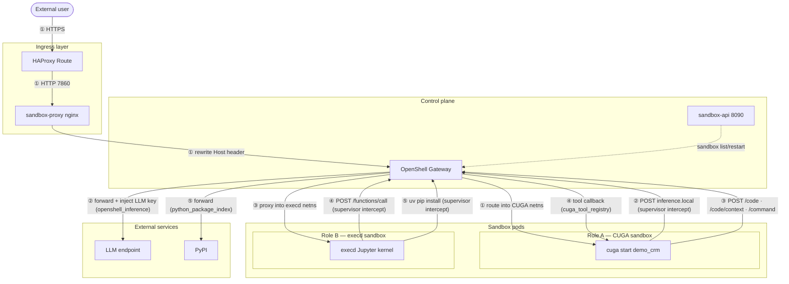
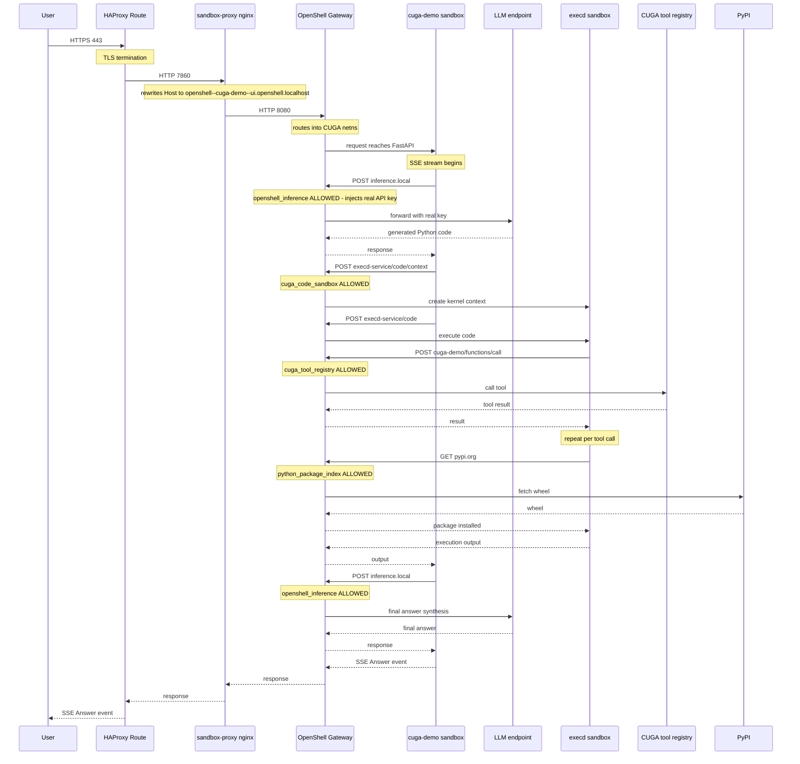

# High Level Design - CUGA Sandbox

## 1. Purpose

CUGA generates and executes Python code on behalf of users. That requires two
independent containment boundaries. This document describes the overall system
architecture, the rationale for key decisions, and the differences between the
two supported deployment targets.

OpenShell is the policy enforcement layer that wraps both the CUGA agent process and the execd code execution pod in private network namespaces — all inbound traffic is routed exclusively through the gateway, all outbound connections are checked per binary against a declared allowlist, each pod's filesystem is locked to declared read/write paths via Landlock, the LLM API key is injected at the gateway so it never reaches either pod, and every connection decision is emitted as a structured audit event.

---

## 2. System overview



The two sandboxes are independent Kubernetes pods (or Docker containers), each
with a private network namespace managed by an OpenShell supervisor. Neither pod
is reachable directly - all inbound traffic goes through the gateway, which
routes by `Host` header into the correct netns.

---

## 3. Two-boundary security model

OpenShell is designed to wrap entire autonomous agent processes — its design
center is policy enforcement and isolation for agentic workloads (Watson
Orchestrate and Red Hat are known reference users for this exact use case). Role
A applies that capability to CUGA. Role B then adds a second, independent
boundary specifically around generated code execution.

Whether to run CUGA inside OpenShell (Role A) is a deployment decision. The
table below shows what each boundary contributes independently.

| | Role A - CUGA pod | Role B - execd pod |
|---|---|---|
| **Wraps** | Entire CUGA agent process | Generated code (Jupyter kernel) |
| **LLM key** | Gateway injects on egress; never reaches pod env | No access to inference endpoint at all |
| **Filesystem** | `/app` read-only; writes to `/sandbox` and `/tmp` only | Writes to `/workspace/<thread>`; agent DBs unreachable |
| **Egress** | Per-binary allowlist: inference + execd only | Per-binary allowlist: tool registry + PyPI only |
| **Privilege** | Unprivileged user, no escalation | Unprivileged user, no escalation |
| **Isolation** | n/a | Separate pod, separate process, no shared env/memory |

- **Role A without Role B** - generated code executes inside the agent process
  with no isolation boundary; it can read agent state, write to agent databases,
  and reach the inference gateway directly. This is where Role A provides the
  most critical protection: without an external code sandbox, wrapping the agent
  process itself is the only line of defence.
- **Role B without Role A** - execd itself remains well-isolated (deny-by-default
  egress, Landlock filesystem, no access to agent DBs or LLM key). The risk is
  the inverse: the CUGA agent process runs without an OpenShell wrapper, so the
  agent itself — not the generated code — is unrestricted and can exfiltrate
  credentials, write to arbitrary paths, or make arbitrary outbound calls.
- **Role A with Role B** - even when code execution is offloaded to an external
  sandbox, Role A is not redundant. It still enforces LLM key injection (the key
  never enters the agent pod), restricts the agent's own egress to `inference.local`
  and `execd-service` only, locks the agent filesystem read-only, and provides a
  full audit trail of every outbound connection. The main difference is that
  with Role B in place, malicious generated code is contained in the execd pod
  and cannot affect the agent process. Without Role B it could.

---

## 4. Components

| Component | Platform | Role |
|---|---|---|
| **OpenShell Gateway** | both | Policy enforcement, lifecycle control, LLM key injection, Host-header routing into sandbox netns. Single Deployment; holds gateway.db (SQLite) on a PVC. |
| **CUGA sandbox** (`openshell--cuga-demo`) | both | Agent runtime. Created and owned by the gateway - not a regular `kubectl apply` pod. Runs `cuga start demo_crm` inside a private netns enforced by `cuga-policy.yaml`. |
| **execd sandbox** (`openshell--code-exec`) | both | Code execution data plane. Runs Jupyter + execd inside a private netns enforced by `execd-policy.yaml`. Serves `POST /code`, `/code/context`, `/command` on `:44772`. |
| **sandbox-proxy** (nginx) | OpenShift only | Rewrites the HTTP `Host` header from the public OCP hostname to `<workspace>--<sandbox>--<service>.openshell.localhost`. Required because HAProxy Route cannot rewrite `Host` and the gateway routes entirely by that header. |
| **sandbox-relay** (Python) | Rancher Desktop only | TCP bridge in the Rancher VM. Sandboxes reach `host.openshell.internal:{44772,8001}`; the relay forwards to the macOS-side `openshell forward` tunnel. Not needed on Kubernetes - Service DNS takes its place. |
| **sandbox-api** | both | Admin-only FastAPI sidecar on `:8090`. Exposes `/ping`, `/status`, `/restart`, `/threads`, `/packages`, `/info`. Not in the user request path. |

---

## 5. Deployment targets

| | Rancher Desktop (macOS) | OpenShift |
|---|---|---|
| **Compute driver** | `docker` socket | `kubernetes` (kube API + RBAC) |
| **Inbound routing** | `openshell forward` host tunnel | HAProxy Route → `sandbox-proxy` → gateway |
| **Host-header rewrite** | Handled natively by `openshell forward` | `sandbox-proxy` nginx Deployment |
| **TLS** | Off | Edge-TLS on OCP Route |
| **Auth** | Unauthenticated (local dev) | OIDC + `X-API-Key` |
| **LLM key** | Secret in gateway container env | Secret `llm-credentials` → gateway pod env |
| **Policy files** | `deploy/rancher/` | `deploy/openshift/` |
| **Internal addresses** | `host.openshell.internal:{44772,8001}` via relay | Service DNS `*.svc.cluster.local` |

---

## 6. Request flow (OpenShift)



On Rancher Desktop the addresses are `host.openshell.internal:{44772,8001}`
(intercepted in the sandbox netns and routed through the relay). The policy
files are otherwise identical across platforms.

---

## 7. Security boundaries

**Network** - each sandbox runs in a private netns with no default route. The
OpenShell supervisor intercepts every outbound TCP connection before it leaves
the netns and checks it against the policy allowlist. A connection is allowed
only when both the destination *and* the calling binary path match.

**Filesystem** - Landlock (Linux kernel feature, configured in `*-policy.yaml`)
restricts which paths each process can read or write. `/app` is read-only for
CUGA; only `/sandbox` and `/tmp` are writable. For execd only `/workspace` is
writable.

**Credentials** - the LLM API key lives exclusively in the gateway container
env, sourced from a Kubernetes Secret. The CUGA sandbox calls
`inference.local:443`; the gateway intercepts, injects the real key, and
forwards. The key is never written to either sandbox pod's filesystem, env, or
process memory.

**Audit** - every ALLOWED/DENIED egress decision is emitted as a structured
OCSF event with binary path, PID, destination host, and policy name.

---

## 8. Architectural decisions

### AD-1 - OpenShell as primary sandbox technology

**Decision:** Use OpenShell (NVIDIA, Rust, Apache 2.0) as the policy-enforcement
and lifecycle layer rather than building a custom sandbox.

**Rationale:** Building a sandbox from scratch with comparable egress control,
netns isolation, key injection, and audit trail is not feasible given time and
maintenance constraints. OpenShell provides all of this declaratively.
Watson Orchestrate and Red Hat are known IBM/partner reference users, reducing
adoption risk.

**Consequence:** The gateway is a required singleton in the request path. HA
requires a Postgres backend for `gateway.db` (today: SQLite on a PVC).

---

### AD-2 - execd (OpenSandbox) for code execution, not OpenShell natively

**Decision:** Use `opensandbox/execd` (Cohere, Apache 2.0) as the code
execution engine inside the Role B sandbox. Use **only the `execd` binary**, not
the full OpenSandbox server.

**Rationale:** OpenShell enforces policy but does not run code. execd provides
a Jupyter kernel protocol over HTTP (`POST /code`, `/code/context`, `/command`)
that CUGA's existing `ExecdExecutor` already speaks (same serialisation as
`E2BExecutor`). The full OpenSandbox server would create its own containers via
Docker/Kubernetes, duplicating what OpenShell already manages.

**Consequence:** execd's inner bubblewrap hardening floor (`opensandbox-launcher`
via `memfd_create`) is disabled because OpenShell's seccomp policy denies
`memfd_create`. OpenShell's own Landlock + netns + unprivileged user provides
equivalent confinement. If the seccomp policy is ever relaxed, re-enable
`[hardening] enabled = true` in `execd-isolation.toml`.

---

### AD-3 - Shared execd pod with per-thread isolation, not one pod per agent

**Decision:** A single execd pod serves all concurrent threads via `context_id`
isolation and per-thread `/workspace/<thread>` directories and `.venv`
virtualenvs.

**Rationale:** One pod per agent would require pre-provisioning N pods before
any agent starts (requirement D14), complicating the catalog model. Per-thread
venvs prevent install conflicts between concurrent threads without per-pod
overhead.

**Trade-offs:**
- ✅ Resource-efficient - 1 pod for N concurrent threads
- ✅ Per-thread venv prevents version conflicts between concurrent installs
- ✅ Clean teardown - `rm -rf /workspace/<thread>` removes all installed packages
- ⚠️ `sys.modules` pollution - all kernel contexts share one Python interpreter;
  a cached module import in thread A may be seen by thread B
- ⚠️ Blast radius - a kernel crash or OOM on the execd pod affects all threads
- ⚠️ Compliance gap - sandbox not pre-validated before agent accepts tasks (D2)

**Decision needed before production:** if one pod per tenant (one user at a
time) → per-pod venv is simpler; if shared pod across concurrent users →
per-thread venv (current) is safer.

---

### AD-4 - sandbox-proxy (nginx) for Host-header rewriting on OpenShift

**Decision:** Deploy a dedicated nginx Deployment (`sandbox-proxy`) in front of
the OpenShell gateway on OpenShift, whose sole job is to rewrite the HTTP `Host`
header.

**Rationale:** The gateway routes all inbound traffic by `Host` header in the
format `<workspace>--<sandbox>--<service>.openshell.localhost`. HAProxy Route
(OCP ingress) cannot rewrite the `Host` header. Without the rewrite, every
request arrives with the public cluster hostname and the gateway cannot determine
which sandbox to route to.

**Consequence:** `sandbox-proxy` is in the critical request path on OpenShift.
Its nginx config is the source of truth for the workspace/sandbox/service name
mapping. This component is not needed on Rancher Desktop where `openshell
forward` handles the mapping natively.

---

### AD-5 - LLM key never enters either sandbox pod

**Decision:** The CUGA sandbox is configured with `OPENAI_API_KEY=unused` and
calls a virtual hostname `inference.local:443`. The gateway intercepts this,
injects the real key from its own env (sourced from a Kubernetes Secret), and
forwards to the real LLM endpoint.

**Rationale:** A compromised agent process cannot exfiltrate a credential it was
never given. This is a hard security property, not a policy recommendation.

**Consequence:** The gateway is a required intermediary for all LLM calls. LLM
endpoint and model are configured at deploy time on the gateway, not inside the
sandbox image.

---

### AD-6 - Deny-by-default egress with per-binary enforcement

**Decision:** Both `cuga-policy.yaml` and `execd-policy.yaml` use
deny-by-default egress allowlists where each allowed connection is tied to a
specific binary path as well as a destination host and port.

**Rationale:** Host-only allowlists are insufficient - any process in the
sandbox could reach an allowed host, not just the intended one. Per-binary
enforcement means `/opt/app-root/bin/uv` can reach PyPI but `/bin/bash` cannot,
even though both are in the same pod.

**Consequence:** Adding a new outbound dependency requires a policy change and
redeployment. This is intentional friction - unreviewed egress is denied by
default.

---

### AD-7 - Manual provisioning today; catalog-provisioned in target state

**Decision (current):** The sandbox is deployed once per developer namespace by
`make ocp-deploy`. `EXECD_URL` and `EXECD_API_KEY` are passed explicitly as env
vars at deploy time.

**Target state:** The sandbox should be a first-class entry in the Sovereign
Core service catalog, provisioned independently of any agent - before the agent
starts - with a readiness signal and a Service Binding that delivers
`SANDBOX_URL` + `SANDBOX_API_KEY` to the agent deployment. No manual wiring
needed.

**Gap (D2):** The catalog broker, readiness gate, and Service Binding integration
have not been implemented. Until they are, `make ocp-deploy` is the only
provisioning path.

#### Current state (POC)

```
developer
  └─ make ocp-deploy NAMESPACE=sandbox-<name> ...
       └─ creates execd pod + cuga-demo pod in namespace
            └─ CUGA env: DYNACONF_ADVANCED_FEATURES__EXECD_URL=http://execd-service...
```

#### Target state (catalog-provisioned)

```
Workspace admin provisions "CUGA Execution Sandbox" from Sovereign Core catalog
  └─ SandboxReconciler (cuga-service-broker) deploys sandbox stack
       into tenant-ns
       └─ deploys: openshell-gateway + execd + sandbox-api + sandbox-proxy
       └─ waits for openshell-gateway rollout (max 3 min)
       └─ openshell gateway add + workspace create + sandbox create
       └─ waits for execd /ping → 200 (max 2 min)
       └─ generates SANDBOX_API_KEY (crypto/rand, 32 bytes hex)
       └─ writes Secret "sandbox-binding" to tenant-ns:
            SANDBOX_URL     = https://execd.<tenant-ns>.apps.<ocp-domain>
            SANDBOX_API_KEY = <generated>

Workspace admin provisions "CUGA Agent" from Sovereign Core catalog
  └─ CugaAgentReconciler reads sandbox-binding
       └─ injects EXECD_URL + EXECD_API_KEY into CugaAgent CR via envFrom
            └─ cuga-operator applies to Deployment
                 └─ CUGA agent starts connected to sandbox automatically
                 └─ no EXECD_URL hardcoded — picked up from sandbox-binding

Additional agents (BYOA, LangGraph)
  └─ read sandbox-binding Secret directly
       └─ set SANDBOX_URL + SANDBOX_API_KEY in their own Deployment
```

Five steps to get there:

1. **Catalog service definition** — register a `sovereign-sandbox` OSB service
   entry in `cuga-service-broker` alongside the existing `general-agent` service.
2. **`SandboxReconciler`** — controller in `cuga-service-broker` that deploys the
   sandbox kustomize stack, runs the `openshell` CLI provisioning sequence, and
   writes Secret `sandbox-binding`. See §NS-2 for the detailed design.
3. **Readiness gate** — `CugaAgentReconciler` returns `202 Accepted` and polls
   until `sandbox-binding` exists before injecting the binding into the agent CR.
4. **`EXECD_URL` from service binding** — `CugaAgentReconciler` adds
   `envFrom: secretRef: sandbox-binding` to the agent Deployment patch. No CUGA
   graph code change needed.
5. **API key on the CUGA→execd leg** — `ExecdExecutor` already reads
   `execd_api_key`; it is delivered via `sandbox-binding` key `SANDBOX_API_KEY`.

---

## 9. Security caveats

These risks exist independent of the sandbox implementation and must be
communicated to customers.

- **Prompt injection** - the sandbox limits blast radius (no internet, no root)
  but cannot prevent malicious code from being generated. Requires guardrails at
  the LLM layer.
- **Sandbox escape** - shared-kernel Docker/Kubernetes. OpenShell Landlock +
  seccomp + netns raises the bar significantly; it is not equivalent to hardware
  isolation. Confidential computing (gVisor, Kata Containers) is the longer-term
  direction.
- **Multi-tenant** - the current single execd sandbox serves all threads via
  directory isolation only. A hard tenant boundary requires one sandbox per
  tenant (see D4, D6).

---

## 10. Implementation status

Status key: ✅ done · ⚠️ partial / open question · ❌ not started / deferred.

| # | Requirement | Description | Status | Notes |
|---|---|---|---|---|
| D1 | OpenShell as primary technology | Building from scratch not feasible; OpenShell provides policy engine, egress control, enforcement. Watson Orchestrate and Red Hat are reference users. | ✅ Done | End-to-end POC on Fyre |
| D2 | Sandbox as catalog entry, provisioned before agent | Cannot be tied to agent startup; must be a catalog prerequisite with readiness signal. | ❌ Not started | Manual `make ocp-deploy` today; catalog broker + readiness gate needed |
| D3 | All three consumer categories: CUGA, BYOA, AI apps | Must serve CUGA OOtB agents, Bring Your Own Agent (LangGraph, LangFlow), and AI-powered applications. | ⚠️ CUGA only validated | execd is generic HTTP; BYOA client pattern documented; not validated with LangGraph/LangFlow |
| D4 | Per-tenant sandbox; tenant as owner/admin | Each tenant must have its own sandbox instance; management APIs tied to account owner. | ⚠️ One namespace per deploy | No tenant-level management UI or API key scoping per tenant yet |
| D5 | Logical isolation per agent; no data intermixing | Data structures and execution state from different agents must never be mixed. | ✅ Done | Per-thread Jupyter kernel + `/workspace/<thread>` + `.venv` |
| D6 | One sandbox serving multiple agents within a tenant | Sharing a single sandbox across agents within a tenant; depends on multi-threaded isolated execution support. | ⚠️ Works but unvalidated at scale | Single execd pod serves all threads via `context_id`; **open decision: per-thread vs per-pod venv** (see AD-3) |
| D7 | Agent cluster vs. tenant cluster | Running in the tenant cluster provides stronger ownership but requires tenant cluster provisioning. | ⚠️ Open | POC runs in shared Fyre cluster; tenant-cluster deployment not yet tested |
| D8 | Curated pip/uv package index; no arbitrary internet installs | Agents must not download arbitrary packages; must enforce access to a curated index. | ✅ Done | `execd_package_index` / `DYNACONF_ADVANCED_FEATURES__EXECD_PACKAGE_INDEX`; PyPI egress requires explicit policy allowlist |
| D9 | Two-tier config: SP default → tenant override | Package index and settings configured at two tiers: service-provider default and tenant override. | ⚠️ SP default only | Env-var / settings.toml tier works; tenant-level DB override not implemented |
| D10 | Sandbox management API | Admin-only HTTP endpoints: status, restart, package list. No interactive shell. | ✅ Done | `sandbox-api`: `/ping`, `/status`, `/restart`, `/threads`, `/packages` |
| D11 | Structured logging: tenant_id, agent_id, thread_id, backend | Lifecycle and per-execution events with full attribution for audit and observability. | ⚠️ Partial | Per-execution logs with `thread=` and `context_id=`; `tenant_id` field missing; no lifecycle schema |
| D12 | Egress control / deny-by-default | Every sandbox interaction fully logged; malicious attempts traceable. | ✅ Done | Declarative allowlists; every hop is an attributed ALLOWED/DENIED OCSF decision |
| D13 | Credential never exposed to sandbox code | Sandbox URL and API key must never be written to sandbox filesystem or visible in generated code. | ✅ Done | Gateway injects LLM key on egress; execd key lives only in CUGA sandbox env, never reaches execd pod |
| D14 | Proactive venv bootstrap (not lazy on first install) | Sandbox must be created and validated when an agent starts, not lazily on first code execution. | ⚠️ Deliberate deviation | Uses shared execd pod with per-thread lazy venv for resource efficiency; compliance gap: failure discovered on first execution, not at startup (see AD-3) |
| D15 | Exposed via REST API with sandbox URL + API key | REST API accessible via sandbox URL and API key; applies to CUGA, BYOA, and AI apps. | ✅ Done | `POST /code`, `/code/context`, `/command`; `X-API-Key` auth |
| D16 | Cross-cluster auth | How CUGA in the agent cluster authenticates to execd in the tenant cluster. | ✅ Done (same-cluster only) | `execd_api_key` in `ExecdExecutor`; Kubernetes Ingress validates `X-API-Key`; cross-cluster design not started |
| D17 | SBOM / license compliance for agent-installed packages | Compliance Center SBOM checks must extend to agent-installed packages. | ❌ Deferred | Post-install `uv pip list --format=json` hook identified; Concert API integration not started |
| D18 | Air-gapped + bare-metal validation | Must include bare-metal validation in both air-gapped and non-air-gapped modes. | ❌ Not started | Fyre/Rancher only; egress deny-by-default is correct posture; bare-metal shift-left TBD |
| D19 | Clear + Purple product parity | Core sandbox component must run as-is in both Clear and Purple versions of Sovereign Core. | ❌ Not validated | No product-variant test; same stack expected to work |
| D20 | Sandboxing ≠ complete security; confidential computing direction | Sandboxing enhances security but does not eliminate risk; confidential computing is the longer-term direction. | ⚠️ Documented only | Prompt injection + escape risks in §Security caveats; gVisor/Kata deferred |
| D21 | OSS alignment / open-source tracking | Must be developed as open-source-aligned component. | ⚠️ Structural | Apache 2.0 deps; no formal OSS tracking process |
| D22 | Integration / authentication across clusters | Cross-cluster auth design identified as required next step after POC. | ❌ Open | Cross-cluster design not started |

---

## 11. Next steps

Three parallel workstreams are needed to move the sandbox from POC to a
production-grade, catalog-provisioned platform service.  They are independent
and can be staffed separately, but they share a contract: the sandbox emits a
**Service Binding** (`SANDBOX_URL` + `SANDBOX_API_KEY`) that any consumer reads.

---

### NS-1 — Sandbox as an independently deployable platform service

**Problem today:** `make ocp-deploy` deploys the sandbox and CUGA together in
the same namespace and in the same script.  There is no way to provision the
sandbox independently, share it across agents of the same tenant, or let a
non-CUGA agent use it.

**Target:** The sandbox (OpenShell gateway + execd + sandbox-api) is a
standalone, tenant-scoped service with its own lifecycle — deployed once per
tenant namespace, used by any number of agents regardless of type (CUGA, BYOA,
LangGraph, AI apps).

**What is needed:**

1. **Separate repository / Helm chart / kustomize package** — the sandbox stack
   lives independently of `cuga-openshell`.  Today it is a subdirectory;
   it should be publishable and deployable on its own, the same way
   `cuga-operator` is independent of the agent runtime.

2. **Dedicated sandbox provisioner** — a controller (see NS-2) or an OSB-style
   broker that provisions the sandbox stack on demand per tenant namespace and
   emits a Service Binding Secret:
   ```
   Secret "sandbox-binding"  (in tenant namespace)
     SANDBOX_URL     = http://execd-service.<ns>.svc.cluster.local:44772
     SANDBOX_API_KEY = <generated, 64-char hex>
   ```

3. **Sandbox readiness signal** — before any agent is allowed to start, the
   platform must verify that `GET /ping` on execd returns 200 and
   `GET /status` on sandbox-api reports `execd.reachable: true`.  This maps
   to requirement D2.

4. **Multi-agent sharing within a tenant** — a single execd sandbox serves all
   threads from all agents in the tenant namespace.  Per-thread isolation
   (separate Jupyter `context_id`, `/workspace/<thread>`, `.venv`) is already
   implemented (D5, D6).  What is missing is the provisioner knowing not to
   create a second sandbox if one already exists.

---

### NS-2 — SandboxReconciler: where does the provisioner live?

**Question:** Should the sandbox get its own operator, or should it be a
reconciler inside `cuga-service-broker`?

**Decision: do not build a separate sandbox operator.**

An operator's reconcile loop makes sense when the reconciled resources are
plain Kubernetes objects (Deployments, Services) that can be diffed against
etcd.  The sandbox control plane is **OpenShell gateway**, whose state lives in
`gateway.db` (SQLite on a PVC) and is mutated through the `openshell` CLI —
not through `kubectl apply`.  A reconcile loop on top of `openshell` CLI calls
adds complexity without providing the idempotency guarantees that make operators
valuable.

**Preferred approach: `SandboxReconciler` inside `cuga-service-broker`**,
parallel to the existing
[`CugaAgentReconciler`](../cuga-service-broker/internal/controller/cugaagent_controller.go).

```
cuga-service-broker
├── CugaAgentReconciler     — already exists; creates CugaAgent CR per agent instance
└── SandboxReconciler       — new; provisions sandbox per tenant namespace
      │
      ├── OSB trigger: PUT /v2/service_instances/:id
      │   (service_id: "sovereign-sandbox", plan: "standard")
      │
      ├── Provision (idempotent):
      │   1. Does Secret "sandbox-binding" exist in tenant-ns?
      │      yes → return 200 (already provisioned)
      │      no  →
      │        a. kubectl apply -k sandbox/deploy/openshift/ -n <tenant-ns>
      │        b. wait for openshell-gateway Deployment rollout (max 3 min)
      │        c. openshell gateway add <tenant-ns>
      │           openshell workspace create default
      │           openshell sandbox create default
      │        d. wait for GET execd-service/ping → 200 (max 2 min)
      │        e. SANDBOX_API_KEY = crypto/rand 32 bytes hex
      │        f. kubectl create secret generic sandbox-binding \
      │             --from-literal=SANDBOX_URL=https://execd.<tenant-ns>.apps.<domain> \
      │             --from-literal=SANDBOX_API_KEY=<key> \
      │             -n <tenant-ns>
      │        g. return 201 Created
      │
      ├── Deprovision:
      │   1. GET /threads on sandbox-api — wait until empty (timeout 5 min)
      │   2. openshell sandbox delete default
      │   3. kubectl delete -k sandbox/deploy/openshift/ -n <tenant-ns>
      │   4. kubectl delete secret sandbox-binding -n <tenant-ns>
      │
      └── Bind (GET /v2/service_instances/:id/service_bindings/:bid):
          returns { SANDBOX_URL, SANDBOX_API_KEY } from sandbox-binding Secret
```

**Alternative considered: separate `sandbox-service-broker`**

If the sandbox needs to serve non-CUGA consumers (LangGraph agents, AI apps,
BYOA) provisioned through a different catalog entry and potentially a different
team, a standalone `sandbox-service-broker` is the cleaner boundary.  It would
implement the same OSB API as `cuga-service-broker` but manage only the sandbox
lifecycle.  The `cuga-service-broker` would then reference the sandbox binding
rather than provision it.

The right split depends on ownership: if the sandbox is owned by the same team
as the CUGA broker → embed `SandboxReconciler` in `cuga-service-broker`.  If
the sandbox becomes a shared platform primitive used across products →
standalone `sandbox-service-broker`.

For the current phase (CUGA POC → production) **embed in `cuga-service-broker`**
is the lower-friction path.

---

### NS-2a — Secret management: where is SANDBOX_API_KEY generated and stored?

This is a cross-cutting concern for NS-2 and NS-3.  The answer differs by
deployment mode.

#### What exists today

`SANDBOX_API_KEY` is generated once by `setup.sh` / `make ocp-deploy` using
`openssl rand -hex 32` and stored in two places:

- **Kubernetes Secret `sandbox-credentials`** in the tenant namespace
  (key: `SANDBOX_API_KEY`) — read by the `sandbox-api` pod at startup.
- **PVC file `/var/lib/openshell/sandbox-api-key`** — survives pod restarts;
  `setup.sh` is idempotent because it skips generation if the file already
  exists.

The Secret is **not** in Vault today.  It is a plain Kubernetes Secret created
imperatively by `make ocp-deploy`.

#### How the cuga-operator handles secrets (reference)

The `cuga-operator` supports two modes configured by `DYNACONF_SECRETS__MODE`:

- **`local`** — secrets live in plain Kubernetes Secrets in the tenant
  namespace.  Default for POC and non-GoRI deployments.
- **`vault`** — secrets are stored in HashiCorp Vault and synced into
  Kubernetes Secrets by the **External Secrets Operator (ESO)**.  The operator
  configures the Vault address, K8s auth role, mount path, and KV version
  via [`DynaconfSecrets`](../cuga-operator/internal/vault/vault.go).

#### Decision for sandbox-binding

Follow the same two-mode pattern as the operator:

| Mode | How `SANDBOX_API_KEY` is generated | Where it lives | Who reads it |
|---|---|---|---|
| **`local`** (default) | `SandboxReconciler` generates with `crypto/rand` (Go) at provision time | Kubernetes Secret `sandbox-binding` in tenant namespace | `sandbox-api` pod via env; CUGA agent via `envFrom` |
| **`vault`** | `SandboxReconciler` writes the generated key to Vault at path `<mount>/sandbox/<tenant-ns>/api-key`; ESO `ExternalSecret` syncs it into `sandbox-binding` k8s Secret | Vault (source of truth) + k8s Secret (replica) | same consumers; Secret is the delivery mechanism regardless of backend |

#### Generation — concrete rules

1. **Generated by `SandboxReconciler`** at provision time, not by a shell
   script.  Use `crypto/rand` in Go — same entropy as `openssl rand -hex 32`.
2. **Generated once per tenant namespace**, not per agent.  Idempotency check:
   if Secret `sandbox-binding` already exists and contains `SANDBOX_API_KEY`,
   skip generation.
3. **Never logged or returned** in API responses.  The broker's `202 Accepted`
   provision response does not include the key; consumers read it from the
   Secret / Service Binding directly.
4. **Rotation** — out of scope for POC.  When needed: generate new key, update
   Secret, rolling-restart `sandbox-api` (reads key at startup).  CUGA agents
   using `envFrom: secretRef` pick up the new key on next pod restart.

#### Secret layout

```yaml
# Kubernetes Secret written by SandboxReconciler
apiVersion: v1
kind: Secret
metadata:
  name: sandbox-binding
  namespace: <tenant-ns>
  labels:
    app.kubernetes.io/managed-by: cuga-service-broker
    sandbox.sovereign.cloud.ibm.com/tenant: <tenant-ns>
type: Opaque
stringData:
  # consumed by sandbox-api pod (SANDBOX_API_KEY env var)
  SANDBOX_API_KEY: <generated>
  # consumed by CUGA agent Deployment (DYNACONF_ADVANCED_FEATURES__EXECD_URL)
  DYNACONF_ADVANCED_FEATURES__EXECD_URL: http://execd-service.<tenant-ns>.svc.cluster.local:44772
  DYNACONF_ADVANCED_FEATURES__EXECD_API_KEY: <same as SANDBOX_API_KEY>
```

The key names are chosen so that the agent Deployment can reference the Secret
directly via `envFrom: secretRef: name: sandbox-binding` without any name
mapping — the env var names in the Secret match what `ExecdExecutor` reads.

---

### NS-3 — CUGA agent binding: switching an agent to use the sandbox

**Problem today:** `DYNACONF_ADVANCED_FEATURES__EXECD_URL` and
`DYNACONF_ADVANCED_FEATURES__EXECD_API_KEY` are hardcoded at deploy time in
`make ocp-deploy`.  There is no mechanism for the platform to wire a running
or newly provisioned CUGA agent to an existing sandbox.

**What is needed:**

1. **`cuga-service-broker` reads sandbox binding and injects it into agent
   patch** — when `buildCugaAgentCR` constructs the `CugaAgent` CR patches, it
   reads `Secret "sandbox-binding"` from the tenant namespace and adds:
   ```go
   // in provision.go, alongside MODEL_NAME and DYNACONF_SERVICE__INSTANCE_ID
   envs = append(envs, map[string]interface{}{
       "name":  "DYNACONF_ADVANCED_FEATURES__EXECD_URL",
       "value": sandboxBinding.ExecdURL,
   })
   envs = append(envs, map[string]interface{}{
       "name":  "DYNACONF_ADVANCED_FEATURES__EXECD_API_KEY",
       "value": sandboxBinding.ExecdApiKey,
   })
   ```
   No code change is needed in CUGA itself — `ExecdExecutor` already reads
   these env vars (D15, D16 are done).

2. **Ordering: sandbox must be Ready before agent is provisioned** — the broker
   must either block agent provisioning until `SandboxReconciler` emits Ready,
   or return `202 Accepted` and poll.  The existing async
   `ASYNC_POLL_INTERVAL` / `ASYNC_POLL_MAX` machinery in the broker already
   supports this pattern.

3. **`cuga-operator` manifest addition** — add placeholder env vars to
   [`channels/packages/cugaagent/1.0.0/manifest.yaml`](../cuga-operator/channels/packages/cugaagent/1.0.0/manifest.yaml)
   so the operator does not strip them on reconcile:
   ```yaml
   - name: DYNACONF_ADVANCED_FEATURES__EXECD_URL
     value: ""          # overridden by broker patch
   - name: DYNACONF_ADVANCED_FEATURES__EXECD_API_KEY
     value: ""          # overridden by broker patch
   ```

4. **`envFrom` alternative** — instead of individual env vars, the agent
   Deployment can reference the sandbox binding Secret directly via `envFrom`,
   which means the agent picks up a rotated key without a re-deploy:
   ```yaml
   envFrom:
     - secretRef:
         name: sandbox-binding
         optional: true   # agent still starts if sandbox not yet ready
   ```
   This requires aligning the Secret key names with what `ExecdExecutor`
   expects (`DYNACONF_ADVANCED_FEATURES__EXECD_URL`,
   `DYNACONF_ADVANCED_FEATURES__EXECD_API_KEY`).

**Relationship to existing components:**

```
SandboxReconciler (NS-2)
  └─ writes Secret "sandbox-binding"
        │
        ├─ CugaAgentReconciler / buildCugaAgentCR (NS-3 step 1)
        │    └─ reads binding → injects into CugaAgent CR patches
        │         └─ cuga-operator applies to Deployment
        │
        └─ (future) BYOA agent reads same Secret directly
             └─ sets SANDBOX_URL + SANDBOX_API_KEY in its own Deployment
```
